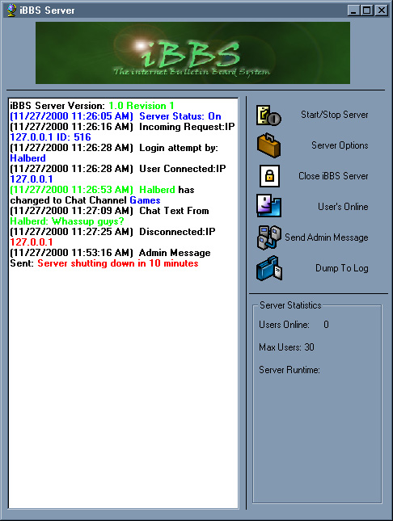



## iBBS tcp client/server

### Description

This is a multi purpose tcp/ip client server program. This will be the last open source version. This version has a huge amount of new stuff. Read the readme.txt for info. It now supports chat(with channels), file download, instant messaging, private mailbox, and public message board. The image below is of the Server. This is a good look into using the winsock control. Also uses collections and the split function, so it will only work with vb6.

For lack of any other way to explain what this is, if you have seen Hotline before, you will have some idea of what iBBS is.

If you like it, please vote.
 
### More Info
 

             |
---                |---
**Submitted On**   |2000-11-30 16:40:20
**By**             |[Chris Andersen](https://github.com/Planet-Source-Code/PSCIndex/blob/master/ByAuthor/chris-andersen.md)
**Level**          |Intermediate
**User Rating**    |4.6 (74 globes from 16 users)
**Compatibility**  |VB 6\.0
**Category**       |[Internet/ HTML](https://github.com/Planet-Source-Code/PSCIndex/blob/master/ByCategory/internet-html__1-34.md)
**World**          |[Visual Basic](https://github.com/Planet-Source-Code/PSCIndex/blob/master/ByWorld/visual-basic.md)
**Archive File**   |[CODE\_UPLOAD1220911302000\.zip](https://github.com/Planet-Source-Code/chris-andersen-ibbs-tcp-client-server__1-13227/archive/master.zip)

